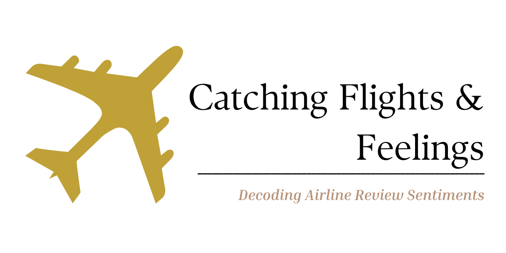

# Sentiment Analysis for Airline Reviews

Author: [Stella Cherotich](https://www.github.com/stellacherotich/)

## Project Overview 
The "Catching Flights & Feelings" Sentiment Analysis project focuses on analyzing airline reviews to gain deeper insights into passengers' emotions and opinions about their travel experiences. By leveraging natural language processing (NLP) techniques, I aim to classify and quantify sentiments expressed in the reviews, including positive, negative, and neutral sentiments.

## Project Objectives 

The objectives of this project is as follows:

1. <b>Topic Extraction</b>: Employing topic modeling techniques to identify the most frequently discussed topics in the reviews, allowing airlines to understand what aspects of their service are being highlighted by passengers.

2. <b>Sentiment Trend Analysis</b>: Analyzing sentiment trends over time to uncover any fluctuations in passenger satisfaction and pinpointing specific periods with notable changes in sentiments.

3. <b>Comparative Analysis</b>: Comparing sentiment and emotion trends across different airlines to identify best practices and areas where specific airlines excel or need improvement.

4. <b>Sentiment Analysis Web App for Airlines</b>: Create a user-friendly web app for airlines, enabling easy sentiment analysis on customer reviews. The app will categorize sentiments as positive, negative, or neutral, helping airlines identify areas for service improvements and enhance customer satisfaction.

5. <b>Sentiment-Based Recommendations</b>: Providing airlines with data-driven recommendations based on sentiment analysis, suggesting actionable steps to improve specific aspects of their service.

## Data Understanding 
The airline's selected for the analysis were: Kenya Airways, Qatar Airways and Emirates.
The data was scraped from this [website](https://www.airlinequality.com/airline-reviews/) using [BeautifulSoup](https://pypi.org/project/beautifulsoup4/#:~:text=Beautiful%20Soup%20is%20a%20library,and%20modifying%20the%20parse%20tree.).

After merging the data, the final dataset that was used for the modeling had 4917 rows and 7 columns. 

The columns in the dataset were :

| Column Name     | Description     |
|-----------------|-----------------------------------------------------------------------------------------------------|
|`reviews`| This column contains the actual text of the airline reviews provided by passengers.   |
| `date`| The `date` column represents the date when each review was submitted or recorded.|
|`verified`| The `verified` column is a boolean indicator that shows whether the review is verified or not.|
| `corpus`| The `corpus` column refers to any preprocessed or cleaned version of the `reviews` column.|
| `sentiment`| The `sentiment` column contains the sentiment label or score assigned to each review.|
| `sentiment_type`| The `sentiment_type` column specifies the type of sentiment analysis performed.|

## Modeling & Deployment 

### <b> Success Metrics </b>

The accuracy score was the main metrics of success that was used, although precision,recall and, f1-score were used for performance comparison. 

### <b> Models </b>

The models used in this project include Count Vectorizer, Topic Modeling with NMF, Logistic Regression, Decision Tree, Random Forest, and Support Vector Classifier (SVC). They collectively enable sentiment analysis and topic identification to gain insights into passenger sentiments and opinions for airlines.

The best performing model was the Logistic Regression as it had the highest accuracy score of 84% . 

The model was deployed using [Streamlit](https://www.streamlit.io). 

To run the app locally, do the following :

- <b> Installing Streamlit</b>(Run this on your terminal):

    pip install streamlit
The Streamlit [documentation](https://docs.streamlit.io/) is provided for your convenience, in case of any errors. 
    
- <b> To run the app locally</b>

    streamlit run App/sentiment.py

To view a screencast of how the app works follow this [link](https://vimeo.com/845738960?share=copy)

## Recommendations 

1. Enhance Positive Experiences: Identify the aspects of the airline service that receive consistently positive sentiments from customers. Allocate resources and efforts towards maintaining and further improving these areas to continue delivering exceptional experiences.

2. Address Negative Sentiments: Identify the specific areas or aspects of the airline service that receive negative sentiments from customers. Take prompt action to address these issues, whether it involves improving processes, providing additional training to staff, or enhancing communication to mitigate customer dissatisfaction.

3. Personalized Customer Interactions: Utilize sentiment analysis to identify individual customer sentiments and preferences. Tailor interactions and offers to each customer based on their sentiments to create personalized experiences and foster customer loyalty.

4. Improve Communication Channels: Pay attention to sentiment analysis results regarding customer feedback on communication channels. Identify any areas of customer frustration or dissatisfaction related to communication and take steps to improve response times, clarity, and overall communication effectiveness.

5. Proactive Issue Resolution: Monitor sentiment analysis results for any emerging negative sentiments or patterns. Take proactive steps to address potential issues before they escalate, ensuring prompt resolution and preventing further customer dissatisfaction.

6. Competitive Analysis: Compare sentiment analysis results with competitors to identify areas where the airline is excelling or lagging behind. Utilize this information to implement strategies for differentiation and improve the overall competitiveness of the airline.

7. Continuous Monitoring: Establish a system for continuous sentiment monitoring and analysis of customer reviews and feedback. Regularly review and analyze sentiment trends to stay updated on evolving customer sentiments and adapt services accordingly.
